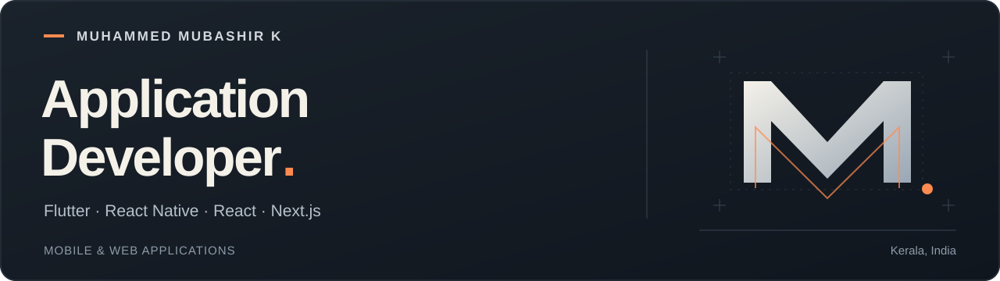

I’m **Muhammed Mubashir K**, a Junior Application Developer at **ENKE Consulting Services LLP** in Kerala, India. I contribute to mobile and web applications for retail, logistics, e-commerce, and business networking.

My experience includes Flutter and React Native applications, React and Next.js storefronts, REST API integrations, authentication, payments, and English/Arabic interfaces.

[Portfolio](https://muhammed-mubashir-portfolio.netlify.app/) · [LinkedIn](https://www.linkedin.com/in/muhammed-mubashir-k/) · [Email](mailto:muhammedmubashir720@gmail.com)

## Selected personal projects

### [StockFlow](https://github.com/MuhammedMubashir-dev/stockflow-flutter)

An offline-first Flutter application for inventory and order management. Includes Riverpod state management, local persistence, responsive layouts, and English/Arabic support.

[Explore the code](https://github.com/MuhammedMubashir-dev/stockflow-flutter) · [Download the Android demo](https://github.com/MuhammedMubashir-dev/stockflow-flutter/releases/latest) · [View CI checks](https://github.com/MuhammedMubashir-dev/stockflow-flutter/actions/workflows/flutter-ci.yml)

### [Next.js E-commerce](https://github.com/MuhammedMubashir-dev/nextjs-ecommerce)

A responsive storefront with server-rendered product data, incremental static regeneration, Algolia search, category filters, cart, checkout, and form validation.

[Explore the code](https://github.com/MuhammedMubashir-dev/nextjs-ecommerce) · [Live demo](https://nextjs-ecommerce-amber.vercel.app/)

### [Developer Portfolio](https://github.com/MuhammedMubashir-dev/my-portfolio)

A presentation of my application development experience, project case studies, and résumé.

[Explore the code](https://github.com/MuhammedMubashir-dev/my-portfolio) · [Visit the portfolio](https://muhammed-mubashir-portfolio.netlify.app/)

## Professional contributions

Applications I have contributed to as part of the team at **ENKE Consulting Services LLP**.

| Application | Technology | Areas of contribution |
| :--- | :--- | :--- |
| **EPOSMOB** | Flutter / Dart | Point-of-sale, billing, inventory, and retail workflows |
| **Ganvin Customer & Executive** | Flutter / Dart | Customer ordering, pickup, delivery, and operational workflows |
| **Connect App** | React Native / TypeScript | Business profiles, connections, authentication, and deep links |
| **Commerce storefronts** | React / Next.js | Search, authentication, orders, and checkout |

## Technical experience

| Area | Technologies and experience |
| :--- | :--- |
| **Mobile** | Flutter, Dart, React Native, TypeScript |
| **Web** | React, Next.js, JavaScript, Tailwind CSS |
| **Integrations** | REST APIs, authentication, payments, Google Maps, Algolia |
| **Application development** | Responsive layouts, English/Arabic localization, RTL interfaces, debugging, Git |
